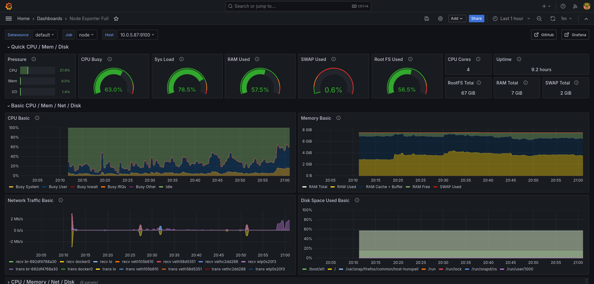
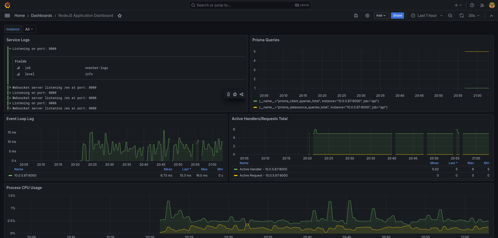

# OneChatCore

This repository is for the backend for [`OneChatClient`](https://github.com/ChampionBuffalo1/OneChatClient).

## Environment variables

All the values in `./.env.example` files must be set as an environment variable; otherwise, the app will crash with an error.

## Building

### Simple

```bash
$ yarn
$ yarn build
```

The above commands will build this typescript project into the `./dist` directory, from where the app can be hosted.

### Docker

The project also has `Docker` support for a better hosting experience.

```bash
$ docker build -t onechat:latest .
$ docker run -d --name onechat --env-file .env -p "8000:8000" onechat:latest
$ docker stop onechat # Stops the container
```

### Stopping the container

```bash
$ docker container rm onechat
$ docker image rm onechat:latest
```

### Docker Compose

Docker compose file is also provided for hosting a `PostgreSQL` database along with the app.

```bash
$ docker compose up -d --build # Starts up the container in background
$ docker compose down # Stops the container
```

In order to delete the Docker volumes, use the `-v` flag in the `down` command.

## Metrics

This repository contains an `monitoring-stack.yml` file, which is a Docker Compose file for creating containers for [prometheus](https://www.cncf.io/projects/prometheus/), [grafana](https://grafana.com/), [grafana-loki](https://grafana.com/oss/loki/) and [node-exporter](https://prometheus.io/docs/guides/node-exporter/).

```bash
# Starting the containers
$ docker compose -f ./monitoring-stack.yml up -d
# List all running containers
$ docker ps
# Stopping the containers
$ docker compose -f ./monitoring-stack.yml down
```

### Web UI

Grafana provides an Web UI for monitoring the metrics; it can be accessed at `http://<your_ip_here>:3000` with the default username and password as `admin`

#### Default Ports for Services

- Prometheus - `9090`
- Grafana Loki - `3100`
- Node Exporter - `9100`

**NOTE** `node-exporter` should be hosted along with the application server, not with the monitoring stack. The project's monitoring stack assumes that both the monitoring stack and the application server run on the same physical device.

### Grafana Dashboard

The project also includes grafana dashboards, which are given below and can be used to create a simple dashboard for visualizing metrics.

- nodejs: Modified version of [`11159`](https://grafana.com/grafana/dashboards/11159-nodejs-application-dashboard/) at [grafana-dashboard.json](./grafana-dashboard.json)
- node-exporter: [`1860`](https://grafana.com/grafana/dashboards/1860-node-exporter-full/)

#### Exmple

- Node exporter


- NodeJS Dashboard


### Security

Secure the `/metrics` route by placing a reverse proxy like `nginx` to block requests from unknown places.
